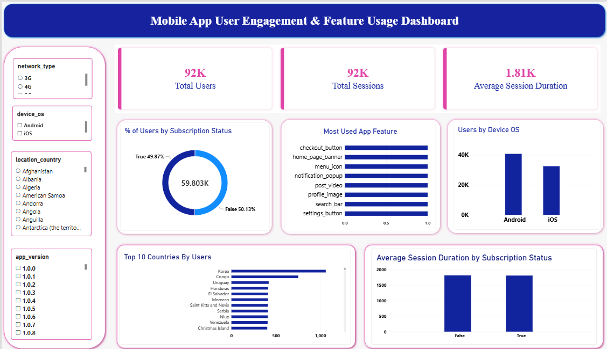

#  Mobile App User Engagement & Feature Usage Analysis

##  Project Overview

This project analyzes mobile app user behavior, feature usage, session activity, device usage, and subscription patterns.

The goal is to understand how users interact with the app and identify insights that can help improve user engagement and app experience.

##  Business Questions

- Which app features are used the most?
- How engaged are the users?
- Which device OS is most commonly used?
- How does session duration vary?
- How do subscribed and non-subscribed users behave?
- Which countries have the highest number of users?
- Which network types are commonly used?

##  Tools & Technologies

- **Excel** – Data cleaning, Pivot Tables and analysis
- **Python (Pandas)** – Data analysis and exploration
- **MySQL** – SQL-based analysis
- **Power BI** – Interactive dashboard

##  Project Workflow

**Raw Data → Excel → Python → MySQL → Power BI**

## 📊 Power BI Dashboard

The dashboard provides an interactive view of:

- Total Users
- Total Sessions
- Average Session Duration
- Subscription Status
- Most Used App Features
- Users by Device OS
- Country-wise User Analysis
- Interactive Filters

##  Analysis Performed

### Excel
- Cleaned the raw dataset
- Removed unwanted and duplicate data
- Created Pivot Tables
- Performed feature usage analysis
- Analyzed engagement trends
- Performed demographic analysis

### Python
- Analyzed unique users and sessions
- Identified most used app features
- Analyzed device OS usage
- Calculated average session duration
- Compared subscribed and non-subscribed users
- Analyzed network and country-wise usage

### SQL
- User and session analysis
- Feature usage analysis
- Device OS analysis
- Subscription-based analysis
- Network usage analysis
- Country-wise user analysis
- Session duration analysis

##  Key Insights

- Identified the most frequently used app features.
- Analyzed overall user engagement through session activity.
- Compared subscribed and non-subscribed user behavior.
- Identified commonly used device operating systems.
- Analyzed user distribution across countries and networks.

##  Future Scope

- Add user retention analysis
- Predict user churn using Machine Learning
- Build real-time dashboards
- Perform advanced user segmentation
- Add predictive engagement analysis

